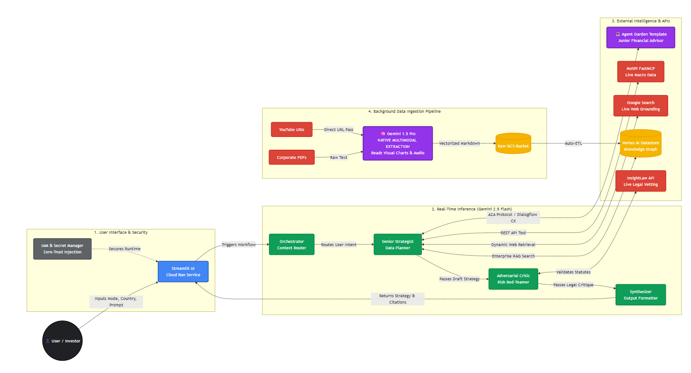

# 📈 AI Investment & Career Strategist

## 1. Purpose of the Application
The **AI Investment & Career Strategist** is a sovereign, multi-agent virtual boardroom designed to democratize elite enterprise consulting for Indian MSMEs and professionals. 

Traditional LLMs often hallucinate financial statistics and lack real-time grounding in regional corporate law. This application solves that asymmetry by fusing real-time macroeconomic data, strict legal vetting, and market risk analysis into a single, cohesive interface. Whether a user is navigating a career transition or planning an aggressive business expansion, the system acts as an expert advisory board, delivering mathematically grounded and legally compliant strategies at zero marginal cost.

---

## 2. Usage Guide

### Getting Started
1. **Launch the App:** Open the Streamlit web interface.
2. **Configure the Boardroom:** In the left sidebar, set your strategy parameters:
   * **Target Market / Region:** (e.g., India, Global, Southeast Asia).
   * **Strategy Mode:** Choose your risk tolerance (Conservative, Balanced, Aggressive Growth).
3. **Engage the AI:** Enter your prompt in the chat box (e.g., *"How should I structure investments for a new green-tech MSME?"* or *"What skills do I need to transition to a product management career?"*).

### Understanding the Output
The system will process your request through its agent network and return a synthesized strategy featuring:
* **Actionable Roadmaps:** Tailored specifically to your region and risk profile.
* **Visual Data:** Clean markdown tables comparing macroeconomic trends or market metrics.
* **Strategic Nudges:** Thought-provoking coaching questions to guide your immediate next steps.
* **Data Provenance (Citations):** Absolute transparency detailing the specific APIs, legal statutes, and live web links used to generate your advice.

---

## 3. System Architecture: The Dual-Pipeline Design

To achieve sub-second inference latency while maintaining deep knowledge, the architecture utilizes a strict Separation of Concerns via a **Dual-Pipeline Ecosystem**.

### Phase 1: The Offline Module (Asynchronous Background Ingestion)
The "Offline" module refers to our background data ingestion engine. Processing heavy files like 40-page legal PDFs or 20-minute macroeconomic YouTube videos in real-time would freeze the user interface. We decouple this completely from the chat loop using a multi-stage ETL pipeline.

* **Trigger Mechanism:** Google Cloud Scheduler (Cron) periodically triggers a headless Cloud Run Job.
* **Data Retrieval:** A **YouTube API Client** programmatically fetches metadata, transcripts, and URIs for relevant market analysis videos.
* **Multimodal Extraction:** The Cloud Run Job feeds these URLs and corporate PDFs directly into **Gemini 1.5 Pro**, leveraging its massive context window and native multimodal capabilities to "watch" videos and "read" charts without third-party scraping tools.
* **The Raw Data Lake (GCS):** Gemini 1.5 Pro outputs highly structured, markdown-formatted summaries and trend analyses. These are temporarily staged in a **Google Cloud Storage (GCS) Bucket** acting as a raw data lake.
* **Enterprise RAG Storage:** An automated ETL process pulls the markdown from the GCS bucket, chunks it, embeds it, and stores it in a **Vertex AI Datastore** (Vector Knowledge Graph). This creates a constantly updating offline knowledge base that the real-time agents can query instantly.

### Phase 2: The Real-Time Inference Module (Synchronous Chat)
A highly scalable, serverless Streamlit frontend connects to a 5-node multi-agent Directed Acyclic Graph (DAG) powered by **Gemini 2.5 Flash**. This engine queries the Datastore built by the Offline Module, combines it with live APIs, and delivers the final response.

---

## 4. Tech Stack & Key Integrations

### Core Stack
* **Frontend:** Streamlit
* **Backend Infrastructure:** Google Cloud Platform (Cloud Run, Cloud Scheduler, Cloud Storage, Secret Manager)
* **AI/Intelligence:** Gemini 2.5 Flash (Inference), Gemini 1.5 Pro (Multimodal Ingestion)
* **Data / RAG:** Vertex AI Datastore

### Live API Integrations
* **MoSPI FastMCP Server:** Official Model Context Protocol integration for live Indian macroeconomic datasets (CPI, IIP, PLFS).
* **InsightLaw API:** Live REST integration utilizing LLM-specified parameters to fetch exact articles of the Indian Constitution, BNS, and MSME Development Act.
* **Vertex Agent Garden / Dialogflow CX:** Pre-built Junior Financial Advisor template for deterministic risk calculations.
* **Google Search Grounding:** Native Vertex AI integration for real-time web retrieval.

---

## 5. Agentic Concepts Used

This application moves beyond basic prompting by implementing enterprise-grade agentic design patterns:

* **Autonomous Multi-Agent DAG:** A 5-node network where distinct AI personas pass state, context, and outputs to one another in a structured flow.
* **Intent-Driven Orchestration:** An initial Gatekeeper agent categorizes user prompts (Career vs. Business) to dynamically load only the relevant tools, preventing API hallucinations.
* **A2A (Agent-to-Agent) Protocol:** The Senior Strategist dynamically halts its own generation to delegate complex financial queries to a secondary AI entity via Dialogflow CX, integrating the response back into its master plan.
* **Adversarial Red-Teaming (GAN-Inspired):** A dedicated "Critic Agent" autonomously vets the Strategist's draft plan against live legal APIs to flag non-compliant advice before the user ever sees it.
* **LLM-Specified Structured Tool Calling:** Instead of regex-guessing search queries, the models utilize strict `FunctionDeclarations` (Automatic Function Calling) to request exact legal corpora (e.g., specific BNS sections vs. constitutional articles).
* **Model Context Protocol (MCP) Integration:** We bypass standard REST wrappers for macroeconomic data by natively connecting to the official MoSPI FastMCP server, ensuring real-time, zero-hallucination statistical grounding directly from the government's data pipelines.
* **LLM-Specified Structured Tool Calling (InsightLaw):** Instead of using regex-guessing for legal queries, the agents utilize strict `FunctionDeclarations` (Automatic Function Calling). The LLM autonomously reasons which explicit legal corpus to query (e.g., triggering `get_bns_section` for modern compliance vs. `get_constitution_article` for foundational rights) by passing structured JSON parameters.

---

## 6. Code Walkthrough

The codebase is strictly modularized for enterprise deployment:

### `ingestion_job.py` (The Offline Module)
* Houses the asynchronous background logic triggered by Cloud Scheduler.
* **YouTube API Integration:** Authenticates and fetches video metadata/URIs based on target market channels.
* **Multimodal Processing:** Manages the Gemini 1.5 Pro API calls for processing complex multimodal inputs (Video/Audio/PDFs) into structured text.
* **GCS Staging:** Handles writing the raw markdown outputs into a Google Cloud Storage bucket.
* **Vertex Datastore ETL:** Orchestrates the final pipeline that chunks the data from GCS, creates vector embeddings, and updates the Vertex AI Knowledge Graph.

### `app.py` (The User Interface)
* Initializes the Streamlit application and manages session state.
* Captures context variables (`mode` and `country`) via the sidebar and injects them directly into the multi-agent workflow.
* Renders the final markdown, visual tables, and UI components.

### `workflow.py` (The Multi-Agent Engine)
Contains the `MultiAgentSystem` class, running on `gemini-2.5-flash` natively through Vertex AI. The workflow follows a strict 5-step logic:
1. **Agent 0 (Orchestrator):** Classifies the user's intent to determine the tool array.
2. **Agent 1 (Web Researcher):** Exclusively utilizes native Google Search grounding to pull live news concurrently.
3. **Agent 2 (Senior Strategist):** Generates a baseline plan using dynamic tool arrays (RAG, MCP, A2A).
4. **Agent 3 (Critic):** Red-teams the baseline plan utilizing the InsightLaw tools (bypassed if the prompt is purely career-focused).
5. **Agent 4 (Synthesizer):** Merges news, strategy, and critique into a formatted response, explicitly generating visual tables and thought-provoking nudges.

### `tools.py` (The External Toolbelt)
Houses the explicit functions exposed to the Gemini models:
* **MCP Handlers:** Synchronous wrappers around asynchronous `mcp` client calls to the MoSPI FastMCP server.
* **REST Wrappers:** Safe `GET` request functions for the InsightLaw API, separated into distinct schemas (`get_constitution_article`, `get_bns_section`, etc.) to enforce LLM precision.
* **A2A Bridge:** The Dialogflow CX integration logic that connects the main orchestration engine to the pre-built Agent Garden Financial Advisor.